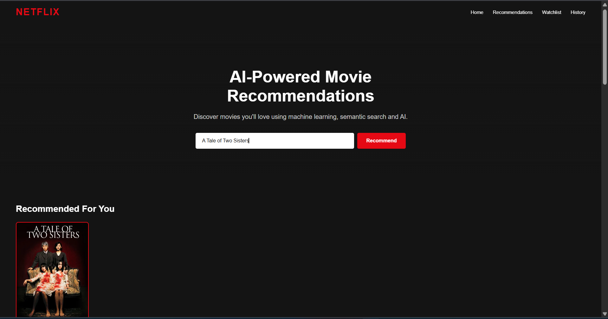
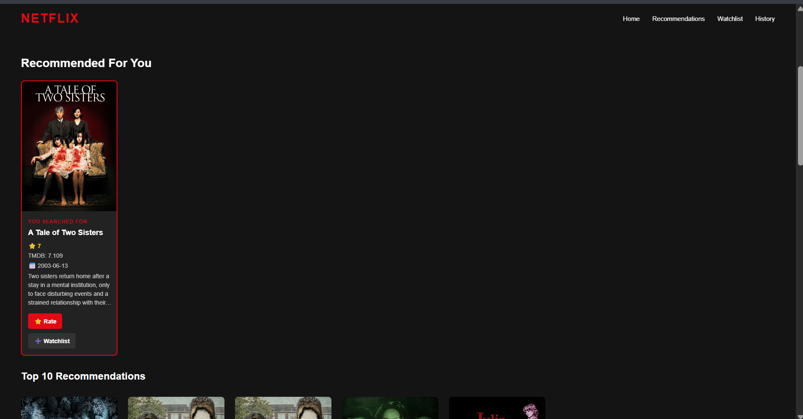
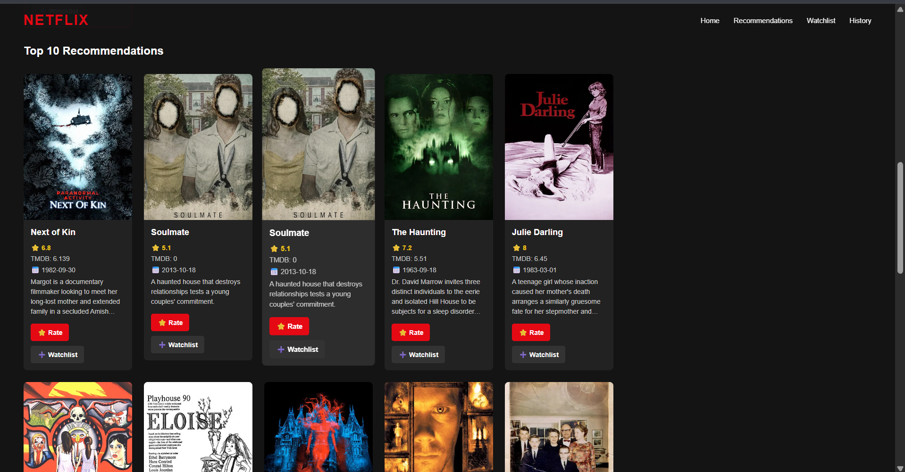
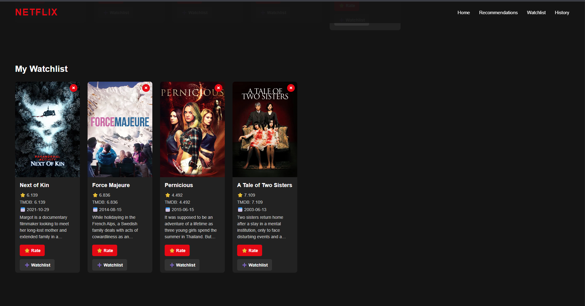
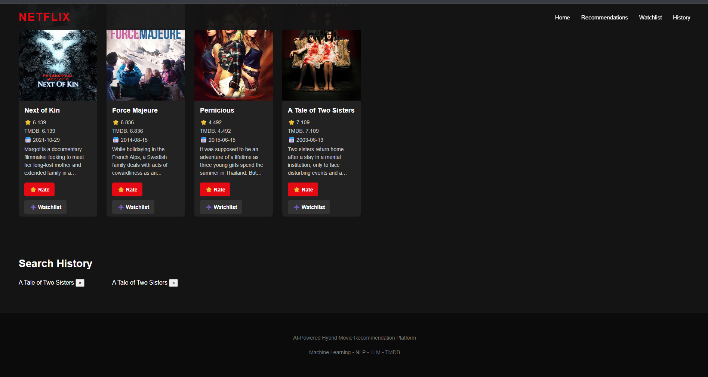

# 🎬 Hybrid Movie Recommendation System


# Application Screenshots

## Home Page



---

## Searched Movie and Recommendations



---

## Top 10 Recommendations



---

## My Watchlist



---

## Search History




# Project Overview

## What Is This Project?

The **AI-Powered Hybrid Movie Recommendation Platform** is an intelligent web-based movie recommendation system that combines **Generative AI, semantic search, collaborative filtering, movie ratings, and user preferences** to provide personalized movie recommendations.

Unlike traditional movie recommendation systems that depend mainly on keywords, ratings, or movie similarity, this platform understands **what the user is actually asking for**.

For example, instead of searching only for:

```text
science fiction movies
```

a user can ask:

```text
I want an emotional science-fiction movie with an exciting story.
```

The system uses **Google Gemini** to understand the natural-language request and extract meaningful preferences such as genre, mood, actor, director, and year.

---

## How Does It Work?

The recommendation process follows a hybrid approach:

```text
User Query
    ↓
Google Gemini
    ↓
Structured User Intent
    ↓
FAISS Semantic Search
    ↓
Candidate Movies
    ↓
Hybrid Recommendation Scoring
    ↓
Semantic Similarity
+
Collaborative Filtering
+
Movie Rating
+
User Preferences
    ↓
Top 10 Recommendations
    ↓
TMDB API
    ↓
Movie Posters + Details
    ↓
Frontend Movie Cards
```

The system first understands the user's request using Gemini. It then uses **FAISS** to find semantically similar movies and generates a group of candidate movies.

These candidates are ranked using multiple signals:

- **Semantic similarity** to understand movie relevance
- **SVD Collaborative Filtering** to consider user/movie preference patterns
- **Movie ratings** to consider overall movie quality
- **Gemini-extracted preferences** to match the user's specific requirements

The highest-scoring movies are selected as the **Top 10 Recommendations**.

The **TMDB API** is then used to enrich the results with movie posters, overviews, ratings, and release dates.

---

## Why Is This Project Important?

Traditional recommendation systems can struggle when a user provides a request that is more descriptive or conversational.

For example:

```text
I want a dark thriller with an emotional story and a strong female character.
```

A simple keyword-based system may not fully understand the relationship between these requirements.

This project addresses that limitation by combining **Generative AI with traditional recommendation techniques**.

The result is a system that can:

- Understand natural-language movie requests
- Find movies based on semantic meaning rather than only exact keywords
- Consider user preferences and rating behavior
- Combine multiple recommendation signals
- Provide personalized and relevant movie suggestions
- Display complete movie information through TMDB
- Allow users to rate movies
- Maintain search history
- Maintain a personal Watchlist

---

## Key Technologies

| Technology | Purpose |
|------------|---------|
| **Google Gemini** | Natural-language query understanding and preference extraction |
| **FAISS** | Semantic similarity search |
| **SVD** | Collaborative filtering and preference prediction |
| **TMDB API** | Movie posters and metadata |
| **SQLite** | Users, ratings, history, and Watchlist storage |
| **Flask** | Backend API |
| **HTML, CSS & JavaScript** | Interactive frontend |

---

## In Short

This project brings together **Generative AI + Semantic Search + Machine Learning + Recommendation Algorithms + External APIs** into a single movie recommendation platform.

Instead of simply asking:

> **"Which movies are similar?"**

the system tries to answer:

> **"What kind of movie is this user actually looking for, and which movies best match that requirement?"**

---

## Detailed Documentation

The sections below provide the complete technical documentation of the project, including the recommendation pipeline, hybrid scoring mechanism, Gemini integration, FAISS search, collaborative filtering, database architecture, backend and frontend implementation, API endpoints, installation, and complete system flow.

If you want to understand the **implementation in detail**, continue with the detailed documentation below.


<p align="center">

⬇️  
⬇️  
⬇️  
⬇️  
⬇️  
⬇️  
### Continue Below for Detailed Documentation 
⬇️  
⬇️  
⬇️  
⬇️  
⬇️  
⬇️  

</p>


## 1. Project Overview

Traditional movie recommendation systems usually rely on only one technique.

For example:

- **Content-based recommendation** recommends movies similar to another movie.
- **Collaborative filtering** recommends movies based on user ratings.
- **Keyword search** depends on exact words.
- **Popularity-based systems** recommend highly rated or popular movies.

This project combines multiple approaches into a single **hybrid recommendation system**.

The system uses:

1. **Google Gemini** for understanding the user's natural-language query.
2. **FAISS** for semantic similarity search.
3. **SVD Collaborative Filtering** for user/movie preference prediction.
4. **Movie ratings** to improve ranking.
5. **Gemini-extracted preferences** such as genre, actor, director, year, and mood.
6. **TMDB API** for movie posters, overviews, ratings, and release dates.
7. **SQLite** for storing users, ratings, search history, and watchlist information.
8. **Flask** for the backend API.
9. **HTML, CSS, and JavaScript** for the frontend.


## 2. Main Objective

The main objective of this project is to build a movie recommendation system that can understand a user's request beyond simple keyword matching.

For example, instead of requiring the user to search:

```text
science fiction movies
```

the user can write:

```text
Give me an emotional science-fiction movie with an exciting story.
```

Gemini extracts the meaningful preferences from the query.

The recommendation engine then combines:

- Semantic similarity
- Collaborative filtering
- Movie rating
- User-requested preferences

to rank the candidate movies.


# 3. Key Features

## 3.1 AI-Powered Query Understanding

The system uses Google Gemini to understand natural-language movie requests.

Gemini extracts information such as:

- Movie
- Genres
- Mood
- Actors
- Director
- Year

### Example

**User Query:**

```text
I want an emotional science-fiction movie directed by Christopher Nolan.
```

Gemini can convert the query into structured information such as:

```text
movie: None

genres:
[
    "science fiction"
]

mood:
"emotional"

actors:
[]

director:
"Christopher Nolan"

year:
None
```

This structured intent is then passed to the recommendation system.


# 4. Complete System Flow

The complete recommendation flow is:

```text
                    USER QUERY
                        |
                        v
              +-------------------+
              |   Google Gemini   |
              |  understand_query |
              +-------------------+
                        |
                        v
                 Structured Intent
                        |
                        v
              +-------------------+
              |   Search Layer    |
              +-------------------+
                   /          \
                  /            \
                 v              v
        semantic_search()   semantic_query_search()
                 \              /
                  \            /
                   v          v
                FAISS Semantic Search
                        |
                        v
                Candidate Movies
                        |
                        v
              +-------------------+
              |   Hybrid Scoring  |
              |   hybrid_score()  |
              +-------------------+
                        |
          +-------------+-------------+
          |             |             |
          v             v             v
     Semantic      Collaborative    Movie
       Score          Filtering     Rating
          |             |             |
          +-------------+-------------+
                        |
                        v
              Gemini Preference Score
                        |
                        v
                 Final Score
                        |
                        v
                 Top 10 Movies
                        |
                        v
                  TMDB API
                        |
          +-------------+-------------+
          |             |             |
          v             v             v
       Poster       Overview       TMDB Rating
                        |
                        v
                 Release Date
                        |
                        v
                Frontend Movie Cards
```


# 5. Detailed Recommendation Flow

## Step 1 — User Enters a Query

The user enters a movie name or natural-language description into the frontend.

Examples:

```text
Interstellar
```

or:

```text
I want a dark and exciting thriller.
```

The frontend sends the request to the Flask backend.

The request is sent to:

```text
POST /recommend
```

The request body contains:

```json
{
    "movie": "Interstellar"
}
```

---

# 6. Step 2 — Gemini Understands the Query

The backend passes the user query to:

```text
understand_query(user_query)
```

Gemini analyzes the query and extracts structured intent.

The intent contains:

```text
movie
genres
mood
actors
director
year
```

For example:

```text
User:

Interstellar
```

can result in:

```text
movie: Interstellar
genres: []
mood: None
actors: []
director: None
year: None
```

For a natural-language request, Gemini can extract additional preferences.

This allows the recommendation system to understand what the user actually wants.


# 7. Step 3 — Semantic Search

After Gemini understands the query, the recommendation system chooses the appropriate search method.

There are two search functions:

```text
semantic_search()
```

and:

```text
semantic_query_search()
```

## 7.1 Movie-Based Search

If Gemini identifies a movie name:

```text
if intent.movie:
```

the system uses:

```text
semantic_search(intent.movie)
```

The system first finds the movie inside the dataset.

The title matching uses:

- Exact matching
- Fuzzy matching

The fuzzy matching is implemented using:

```text
RapidFuzz
```

This makes the system more tolerant of small differences in movie names.

---

# 8. Step 4 — FAISS Semantic Search

The project uses **FAISS** for semantic similarity search.

FAISS stands for:

```text
Facebook AI Similarity Search
```

The system stores movie embeddings and uses a FAISS index to find movies that are semantically similar.

The search operation is:

```python
scores, indices = index.search(
    query,
    top_k
)
```

The result contains:

```text
Similarity Scores
+
Movie Indices
```

The system initially retrieves a larger candidate set rather than immediately selecting only 10 movies.

For example:

```text
Top 50 candidate movies
```

These candidates are then passed to the hybrid recommendation algorithm.

---

# 9. Step 5 — Candidate Movies

The indices returned by FAISS are used to retrieve movies from the movie dataset.

Conceptually:

```text
FAISS
  |
  v
Movie indices
  |
  v
Movie dataset
  |
  v
Candidate movies
```

The candidate movies contain information used by the ranking system, including:

- Movie ID
- Title
- Genres
- Cast
- Crew
- Release date
- Vote average
- Other dataset information

---

# 10. Step 6 — Hybrid Recommendation

The candidate movies are passed to:

```text
hybrid_score()
```

This is the core ranking component of the project.

The system combines multiple signals instead of relying on only semantic similarity.

The final score is calculated using:

```text
40% Semantic Score
25% Collaborative Filtering Score
15% Movie Rating Score
20% Gemini Preference Score
```

Therefore:

```text
Final Score =
    0.40 × Semantic Score
  + 0.25 × Collaborative Score
  + 0.15 × Rating Score
  + 0.20 × Preference Score
```


# 11. Semantic Score

The semantic score represents how similar the candidate movie is to the user's query or selected movie.

FAISS provides the similarity score.

The system normalizes these scores before combining them with the other recommendation signals.

Conceptually:

```text
Movie A → high semantic similarity
Movie B → medium semantic similarity
Movie C → low semantic similarity
```

The normalized semantic score contributes:

```text
40%
```

to the final recommendation score.

This is the largest individual component of the hybrid ranking system.

---

# 12. Collaborative Filtering

The system also uses **SVD Collaborative Filtering**.

SVD stands for:

```text
Singular Value Decomposition
```

The collaborative filtering model predicts how strongly a user may prefer a particular movie.

The system uses:

```python
svd_model.predict(
    user_id,
    movie_id
)
```

The predicted rating is converted into a normalized score.

The collaborative filtering component contributes:

```text
25%
```

to the final score.

This allows the system to consider user/movie preference patterns in addition to semantic similarity.

---

# 13. Movie Rating Score

The system also considers the movie's existing rating.

The movie's:

```text
vote_average
```

is normalized from a 10-point scale into a 0–1 range.

For example:

```text
8 / 10
```

becomes:

```text
0.8
```

This contributes:

```text
15%
```

to the final recommendation score.

---

# 14. Gemini Preference Score

Gemini can identify user preferences such as:

- Genre
- Actor
- Director
- Year
- Mood

The hybrid system compares these preferences against candidate movie information.

## Genre Matching

If the requested genre matches the movie's genres:

```text
+0.30
```

is added to the preference score.

---

## Actor Matching

If the requested actor appears in the movie cast:

```text
+0.20
```

is added.

---

## Director Matching

If the requested director matches the movie's crew:

```text
+0.25
```

is added.

---

## Year Matching

If the requested year matches the movie's release year:

```text
+0.15
```

is added.

---

## Mood Matching

The system maps moods to related genres.

Examples:

```text
emotional
    → drama
    → romance

romantic
    → romance

funny
    → comedy

scary
    → horror
    → thriller

exciting
    → action
    → adventure
    → thriller

dark
    → crime
    → thriller
    → horror

family
    → family
    → animation

relaxing
    → comedy
    → romance
    → family
```

A matching mood contributes:

```text
+0.10
```

to the preference score.

The final Gemini preference component contributes:

```text
20%
```

to the hybrid score.


# 15. Final Hybrid Score

After calculating all components, every candidate movie receives a final score.

The formula is:

```text
Final Score =

0.40 × Semantic Score

+

0.25 × Collaborative Score

+

0.15 × Vote Score

+

0.20 × Gemini Preference Score
```

The candidate movies are then sorted in descending order:

```python
candidate_movies.sort_values(
    by="final_score",
    ascending=False
)
```

The highest-scoring movies are therefore ranked first.

---

# 16. Step 7 — Top 10 Recommendations

After ranking, the system selects:

```python
recommendations.head(10)
```

This gives the final:

```text
Top 10 Recommendations
```

The searched movie itself is removed from the recommendation list when applicable.

Therefore, if the user searches:

```text
Interstellar
```

the interface can show:

```text
Your Searched Movie

Interstellar
```

followed by:

```text
Top 10 Recommendations
```

without showing Interstellar again as one of the recommendations.

---

# 17. Step 8 — TMDB API

After the recommendation ranking is complete, the system uses the **TMDB API** to retrieve additional movie information.

The TMDB service uses:

```text
get_movie_details(movie_name)
```

The system searches TMDB using the movie title.

TMDB provides information such as:

- Poster
- Overview
- TMDB rating
- Release date

The poster URL is constructed using the TMDB image base URL.

This allows the frontend to display real movie posters instead of relying only on the local dataset.

---

# 18. Movie Card Data

Each final movie card can contain:

```text
Movie Poster

Movie Title

⭐ Rating

TMDB Rating

📅 Release Date

Movie Overview

⭐ Rate

➕ Watchlist
```

The same movie-card structure is reused for the Watchlist.

This keeps the recommendation and Watchlist interface consistent.

---

# 19. Watchlist

The application allows users to add movies to a personal watchlist.

The frontend sends:

```text
POST /watchlist
```

with:

```json
{
    "movie_title": "Interstellar"
}
```

The movie is stored in the SQLite database.

The Watchlist can then be retrieved using:

```text
GET /watchlist
```

The Watchlist uses the same movie-card structure as the recommendation section.

It can display:

- Poster
- Title
- Rating
- TMDB rating
- Release date
- Overview
- Rate button
- Remove button

Movies can be removed using:

```text
DELETE /watchlist/<id>
```

---

# 20. Search History

Whenever a searched movie is successfully processed, it can be stored in the movie history table.

The application provides:

```text
GET /history
```

to retrieve the search history.

Individual history records can be deleted using:

```text
DELETE /history/<id>
```

The frontend provides a small:

```text
×
```

next to each history item.

Clicking the `×` removes that specific history record.

---

# 21. Movie Ratings

Users can rate movies from:

```text
1 to 5
```

The frontend sends the rating to:

```text
POST /rate
```

Example:

```json
{
    "movie_title": "Interstellar",
    "rating": 5
}
```

The rating is stored in the SQLite database.

The ratings can be retrieved using:

```text
GET /ratings
```


# 22. Database

The application uses **SQLite**.

The database contains the following tables:

## Users

Stores users:

```text
id
username
created_at
```

## Movie History

Stores searches:

```text
id
user_id
movie_title
searched_at
```

## Ratings

Stores movie ratings:

```text
id
user_id
movie_title
rating
rated_at
```

## Watchlist

Stores saved movies:

```text
id
user_id
movie_title
added_at
```

---

# 23. Backend Architecture

The backend is implemented using **Flask**.

The main application starts Flask and registers the movie routes.

Conceptually:

```text
Flask Application
       |
       v
Movie Routes
       |
       +----------------+
       |                |
       v                v
Recommendation      Database
System              Operations
       |
       +----------------+
       |
       v
Gemini
FAISS
SVD
TMDB
```

---

# 24. Backend Components

## app.py

Responsible for:

- Creating the Flask application
- Enabling CORS
- Registering routes
- Loading required models
- Starting the Flask server

---

## routes.py

Responsible for API endpoints such as:

```text
/recommend
/rate
/watchlist
/history
/ratings
```

and their related operations.

---

## recommender.py

Responsible for the main recommendation pipeline.

It:

1. Calls Gemini.
2. Performs semantic search.
3. Retrieves candidate movies.
4. Applies hybrid scoring.
5. Removes the searched movie where required.
6. Selects the Top 10.
7. Fetches TMDB details.
8. Builds the final recommendation response.

---

## hybrid.py

Responsible for calculating the hybrid recommendation score.

It combines:

```text
Semantic similarity
+
Collaborative filtering
+
Movie rating
+
Gemini preferences
```

---

## services/search.py

Responsible for semantic retrieval.

It uses:

```text
FAISS
```

and:

```text
RapidFuzz
```

for movie matching and semantic search.

---

## services/tmdb.py

Responsible for communication with the TMDB API.

It retrieves:

```text
Poster
Overview
TMDB Rating
Release Date
```

---

## services/gemini.py

Responsible for communicating with Google Gemini and understanding the user's query.

---

## database/database.py

Responsible for SQLite operations including:

```text
Database initialization
User creation
Movie history
Ratings
Watchlist
Deleting history
Deleting watchlist items
```

---

# 25. Frontend Architecture

The frontend consists of:

```text
HTML
CSS
JavaScript
```

## index.html

Provides the structure of the application.

It contains:

- Navigation
- Hero section
- Search box
- Recommendation section
- Watchlist section
- History section
- Footer

---

## style.css

Responsible for:

- Netflix-style dark interface
- Navigation styling
- Search box
- Movie cards
- Recommendation grid
- Watchlist cards
- History cards
- Responsive design

---

## script.js

Responsible for frontend functionality.

It handles:

- Sending recommendation requests
- Displaying recommendation cards
- Loading Watchlist
- Loading Search History
- Rating movies
- Adding movies to Watchlist
- Removing Watchlist items
- Removing History items
- Handling errors
- Loading states

---

# 26. API Endpoints

| Method | Endpoint | Description |
|--------|----------|-------------|
| GET | `/` | Check whether the API is running |
| POST | `/recommend` | Generate movie recommendations |
| POST | `/rate` | Save a movie rating |
| GET | `/ratings` | Retrieve ratings |
| POST | `/watchlist` | Add a movie to Watchlist |
| GET | `/watchlist` | Retrieve Watchlist |
| DELETE | `/watchlist/<id>` | Remove a Watchlist item |
| GET | `/history` | Retrieve Search History |
| DELETE | `/history/<id>` | Delete a Search History item |


# 27. Complete User Journey

A typical user interaction looks like this:

```text
1. User opens the application.

        ↓

2. User enters:

   "Interstellar"

        ↓

3. Frontend sends:

   POST /recommend

        ↓

4. Flask receives the request.

        ↓

5. Gemini understands the query.

        ↓

6. Gemini returns structured intent.

        ↓

7. semantic_search() is executed.

        ↓

8. FAISS finds similar movies.

        ↓

9. Candidate movies are created.

        ↓

10. hybrid_score() ranks candidates.

        ↓

11. SVD predicts collaborative scores.

        ↓

12. Movie rating score is calculated.

        ↓

13. Gemini preference score is calculated.

        ↓

14. Final hybrid score is calculated.

        ↓

15. Movies are sorted.

        ↓

16. Top 10 movies are selected.

        ↓

17. TMDB API provides:

       Poster
       Overview
       TMDB Rating
       Release Date

        ↓

18. Flask returns JSON.

        ↓

19. JavaScript receives the response.

        ↓

20. Movie cards are generated.

        ↓

21. User sees:

       Searched Movie

       +

       Top 10 Recommendations
```

---

# 28. Example Recommendation Flow

For a query:

```text
Interstellar
```

the system performs:

```text
Interstellar
      ↓
Gemini
      ↓
movie = Interstellar
      ↓
semantic_search("Interstellar")
      ↓
FAISS
      ↓
50 candidate movies
      ↓
Hybrid Ranking
      ↓
Semantic Score       40%
Collaborative Score  25%
Rating Score         15%
Preference Score     20%
      ↓
Sorted Candidates
      ↓
Top 10
      ↓
TMDB API
      ↓
Posters + Details
      ↓
Frontend Cards
```

---

# 29. Why a Hybrid Recommendation System?

A hybrid system is useful because each recommendation technique has limitations.

## Semantic Search

Good for:

```text
Finding movies with similar meaning/content.
```

But it does not necessarily understand a user's historical preferences.

---

## Collaborative Filtering

Good for:

```text
Learning user/movie preference patterns.
```

But it can struggle with limited user interaction data.

---

## Movie Ratings

Useful for:

```text
Prioritizing highly rated movies.
```

But ratings alone do not guarantee that a movie matches the user's request.

---

## Gemini Preferences

Useful for:

```text
Understanding natural-language requests.
```

But preference extraction alone does not provide semantic similarity or collaborative ranking.

---

## Hybrid Approach

Combining all of these produces a more comprehensive ranking:

```text
Semantic Understanding
        +
User Preference
        +
Collaborative Filtering
        +
Movie Quality
        =
Hybrid Recommendation
```

---

# 30. Technologies Used

## Programming Languages

- Python
- JavaScript
- HTML
- CSS

## Backend

- Flask
- Flask-CORS

## AI / NLP

- Google Gemini
- Natural Language Processing

## Semantic Search

- FAISS
- Movie embeddings

## Recommendation

- Hybrid recommendation
- SVD Collaborative Filtering
- Semantic similarity
- Preference-based ranking

## External API

- TMDB API

## Database

- SQLite

## Python Libraries

- Requests
- RapidFuzz
- FAISS
- Flask
- Flask-CORS
- Pandas
- Scikit-learn / Surprise components as used by the project
- Google Gemini-related libraries used by the project

---

# 31. Project Structure

```text
AI-Powered Hybrid Movie Recommendation Platform/
│
├── backend/
│   │
│   ├── database/
│   │   └── database.py
│   │
│   ├── loaders/
│   │   └── model_loader.py
│   │
│   ├── services/
│   │   ├── gemini.py
│   │   ├── search.py
│   │   └── tmdb.py
│   │
│   ├── app.py
│   ├── config.py
│   ├── hybrid.py
│   ├── recommender.py
│   ├── routes.py
│   └── users.db
│
├── dataset/
│
├── frontend/
│   ├── assets/
│   │   └── default-poster.jpg
│   ├── index.html
│   ├── script.js
│   └── style.css
│
├── models/
│
├── notebooks/
│
├── tests/
│
├── utils/
│
├── venv/
│
├── .env
├── .gitignore
├── README.md
└── requirements.txt
```

---

# 32. Installation

## Step 1 — Clone the Repository

```bash
git clone <repository-url>
```

Move into the project directory:

```bash
cd <project-folder>
```

---

# 33. Step 2 — Create Virtual Environment

Create a virtual environment:

```bash
python -m venv venv
```

Activate it on Windows:

```bash
venv\Scripts\activate
```

---

# 34. Step 3 — Install Dependencies

Install the dependencies:

```bash
pip install -r requirements.txt
```


# 35. Step 4 — Configure Environment Variables

Create a `.env` file.

Add the required API credentials.

Example:

```env
TMDB_API_KEY=your_tmdb_api_key
GOOGLE_API_KEY=your_google_api_key
```

Use the exact variable names expected by your current `config.py`.

Do not expose API keys publicly.

Do not commit `.env` to GitHub.

---

# 36. Step 5 — Run the Backend

Activate the virtual environment:

```bash
venv\Scripts\activate
```

Start Flask:

```bash
python backend/app.py
```

The API runs on:

```text
http://127.0.0.1:5000
```

---

# 37. Step 6 — Run the Frontend

Open the `frontend` directory using VS Code.

The frontend can be launched using Live Server or another local static web server.

The frontend communicates with the Flask backend:

```text
Frontend
   ↓
http://127.0.0.1:5000
   ↓
Flask API
```

---

# 38. Environment and Security

The following files should not be committed to GitHub:

```text
.env
venv/
users.db
__pycache__/
*.pyc
```

Example `.gitignore`:

```gitignore
venv/
.env
__pycache__/
*.pyc
users.db
```

API keys should always be stored in environment variables rather than directly inside source code.

---

# 39. Error Handling

The backend handles errors for:

- Missing movie/query
- Invalid ratings
- TMDB API failures
- Database failures
- Recommendation failures
- Invalid Watchlist operations
- Invalid History operations

The frontend displays appropriate error messages when API requests fail.

---

# 40. Loading State

When a recommendation request is being processed, the frontend displays:

```text
Finding the best movies for you...
```

The Recommend button changes to:

```text
AI Searching...
```

and is temporarily disabled.

After the request finishes, the button returns to:

```text
Recommend
```

---

# 41. Responsive Design

The frontend is designed to work across different screen sizes.

The movie-card grid adapts for:

```text
Desktop
Tablet
Mobile
```

The navigation and recommendation layout also adjust according to screen width.

---

# 42. Current Recommendation Architecture

The recommendation architecture can be summarized as:

```text
             ┌──────────────────┐
             │    User Query    │
             └────────┬─────────┘
                      │
                      v
             ┌──────────────────┐
             │      Gemini      │
             │ Query Understanding
             └────────┬─────────┘
                      │
                      v
             ┌──────────────────┐
             │  Search Service  │
             └────────┬─────────┘
                      │
             ┌────────┴────────┐
             │                 │
             v                 v
       Movie Search      Natural Query
             │                 │
             v                 v
       semantic_search  semantic_query_search
             │                 │
             └────────┬────────┘
                      │
                      v
                ┌───────────┐
                │   FAISS   │
                └─────┬─────┘
                      │
                      v
              Candidate Movies
                      │
                      v
              ┌───────────────┐
              │ Hybrid Scorer │
              └───────┬───────┘
                      │
       ┌──────────────┼──────────────┐
       │              │              │
       v              v              v
   Semantic       SVD/CF        Vote Rating
    40%             25%             15%
       │              │              │
       └──────────────┼──────────────┘
                      │
                      v
             Gemini Preferences
                    20%
                      │
                      v
                Final Ranking
                      │
                      v
                   Top 10
                      │
                      v
                 TMDB API
                      │
       ┌──────────────┼──────────────┐
       │              │              │
       v              v              v
    Poster        Overview       TMDB Rating
                      │
                      v
                Release Date
                      │
                      v
               Frontend Cards
```

---

# 43. Final System Summary

The complete system works as a pipeline:

```text
User Query
    ↓
Gemini understand_query()
    ↓
Structured Intent
    ↓
FAISS Semantic Search
    ↓
Candidate Movies
    ↓
Hybrid Scoring
    ↓
Semantic Score
+
SVD Collaborative Filtering
+
Movie Rating
+
Gemini Preference Score
    ↓
Final Ranking
    ↓
Top 10 Recommendations
    ↓
TMDB API
    ↓
Poster + Overview + TMDB Rating + Release Date
    ↓
Frontend Movie Cards
```

The project therefore combines **Generative AI, semantic search, collaborative filtering, and external movie metadata** into one complete movie recommendation platform.


# 44. Conclusion

The AI-Powered Hybrid Movie Recommendation Platform demonstrates how multiple AI and machine-learning techniques can be combined to build a practical recommendation application.

Instead of relying on a single recommendation technique, the system combines:

```text
Google Gemini
       +
FAISS
       +
SVD Collaborative Filtering
       +
Movie Ratings
       +
Preference Matching
       +
TMDB
```

The result is a complete end-to-end recommendation platform capable of:

- Understanding natural-language movie requests
- Performing semantic movie retrieval
- Ranking movies using multiple recommendation signals
- Producing Top 10 recommendations
- Displaying real movie posters and metadata
- Saving user ratings
- Maintaining search history
- Maintaining a personal Watchlist
- Removing Watchlist and History items
- Providing an interactive web interface

The project demonstrates how **Generative AI, semantic search, machine learning, recommendation algorithms, databases, APIs, and web technologies** can work together to create an intelligent and user-friendly movie recommendation platform.

---

## Final Architecture

```text
User
 ↓
Frontend
 ↓
Flask Backend
 ↓
Google Gemini
 ↓
Structured Intent
 ↓
FAISS Semantic Search
 ↓
Candidate Movies
 ↓
Hybrid Recommendation
 ├── Semantic Score
 ├── Collaborative Filtering
 ├── Movie Rating
 └── Gemini Preference Score
 ↓
Top 10 Recommendations
 ↓
TMDB API
 ↓
Movie Posters + Metadata
 ↓
Frontend Movie Cards
```